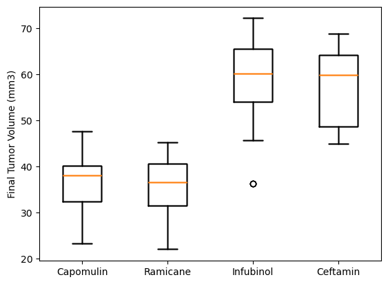
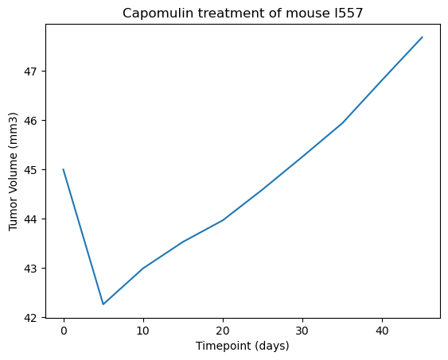
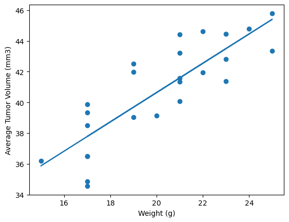

# Matplotlib-Challenge
Module 5 Challenge

All of the code, calculations, figures, tables, and observations requested in this assignment are in the file pymaceuticals_final.ipynb. My observations from this assignment are:

1. The box plot shows that the Capomulin treatment and the Ramicane treatment were more effective than the Infubinol treatment and the Ceftamin treatment. The box plot shows that the distribution of the final tumor volume for Capomulin and Ramicane are much lower than the disribution of the final tumor volumes for Infubinol and Ceftamin. 

2. The line chart for the Capomulin treatment of mouse I557 shows that the treatment seemed to work in the beginning but ended up not being effective over time. The line plot shows that the Tumor Volume dropped over the first week of treatment but then started increasing again and surpassed it's original size.

3. The correlation coefficient between mouse weight and the average tumor volume shows that a mouses weight has a direct effect on the tumor size. With the linear regression model we can easily see that the mouse's tumor size increases with their weight. 

